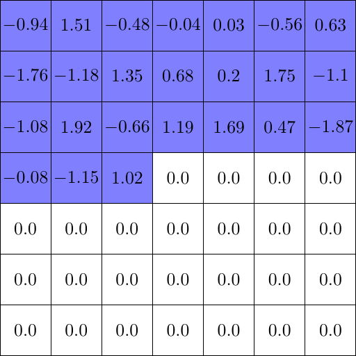

# tikzNN
Neural Net related illustrations using TikZ.

Includes `.tex` source code + results in `.pdf`, `.png` format.

## Examples

- [PixelCNN](https://arxiv.org/abs/1606.05328) masks

 

- Multi scale modelling from [MelNet](https://arxiv.org/abs/1906.01083)


## how to convert pdf to png

```bash
pdftoppm input.pdf output -png -r 300 -scale-to 512
```

